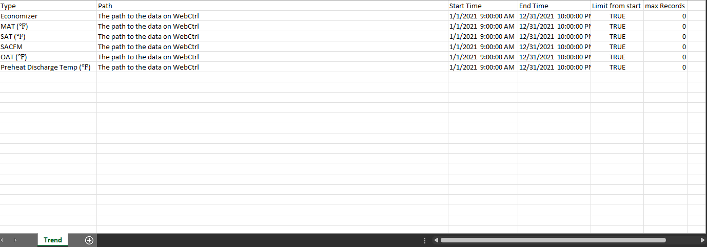

# WebCtrl-prototype
## Description
This is a prototype to create a baseline graph from existing data. The data is obtained from WebCtrl and NOAA database.

## Code Dependencies
1. Aspose Cells for Java. https://docs.aspose.com/cells/java/
2. GSON. https://github.com/google/gson
3. dotenv-java. https://github.com/cdimascio/dotenv-java
4. NOAA API links.  https://www.ncei.noaa.gov/support/access-data-service-api-user-documentation
5. List of stations for NOAA API: https://www1.ncdc.noaa.gov/pub/data/ghcn/daily/ghcnd-stations.txt
6. Detailed documentation on NOAA API link: https://www.ncei.noaa.gov/pub/data/cdo/documentation/GHCND_documentation.pdf

## How to use
1. Setting up environment variables to login to webctrl. Create a file named `.env` with these values: 

```
USER=<User name to login>
PASS=<Password>
```

2. Creating and Initializing the baseline Excel file.
Create an Excel with the following values in a Sheet named: `Trend`



The column `Type` contains the names of the data. This name will appear on other sheets to indicate where the data is coming from. The names provided in the example are must-have name. Without these, the code will not work.

The column `Path` contains the path to the data on WebCtrl.

The column `Start Time` contains the start times.

The column `End Time` contains the end times.

The column `Limit from Start` contains boolean values. If it is true, the number of data retrieved will be equal to the number specified in the next column `max Records` and the data will be retrieved from the start time. 
Otherwise, it will return data from end time to start time.

The column `max Records` contains the number of records to retrieve. If it is `0`, that means retrieve all data.

4. Creating and Initializing the Excel file to be compared. This is the same as the previous step.

5. Setting values for `src/Main.java` so we can start the program. 

`baseLine` is the baseline Excel

`compare` is the comparing Excel

`output` is where the baseline should be output to.